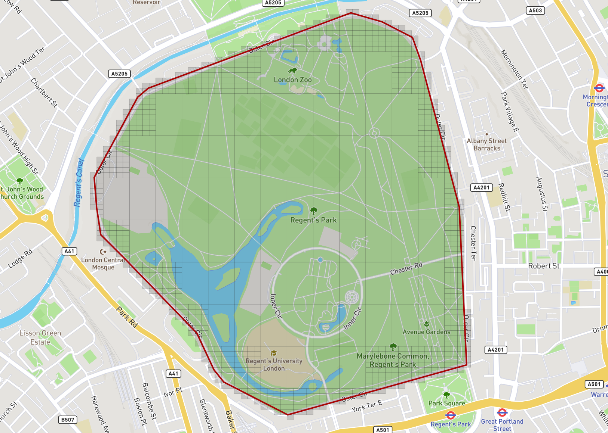

[](http://godoc.org/github.com/Willyham/hashfill) [](https://goreportcard.com/report/github.com/Willyham/hashfill)

## Usage

Hashfill is a library for computing the set of geohashes which are contained by a geofence. It can either produce a set
of hashes which are completely contained or one which also includes where the boundaries intersect. It currently operates on
`geom.Polygon` objects from the [https://github.com/twpayne/go-geom](go-geom) pacakge. Converting from geojson is simple and this
package may offer a utility in the future.

```golang
geofence := readFileAsGeometry("testdata/regents.geojson")
filler := hashfill.NewRecursiveFiller(
  hashfill.WithMaxPrecision(8),
)

hashes, err := filler.Fill(geofence, hashfill.FillIntersects)
```

Would result in something that could be visualized as:



### Installation

This library depends on headers from the `geos` library. You can install with `brew install geos` or `dnf install geos-devel` on RPM based linux distros.

### Options
- `WithMaxPrecision` - Sets the max hash precision the algorithm will generate hashes for.
- `WithFixedPrecision` - Causes the fully contained geohashes to still be divided into the hashes of the max precision.
- `WithPredicates` - Can be used to supply your own functions for `Intersect` and `Contains` rather than the built in ones.


### Improvements

TODO:

- [] Fix bug in geofences with holes.
- [] Corner based check optimisations (+ hybrid)
- [] Cache poly to geom operation in predicates.
- [] Add benchmarks
